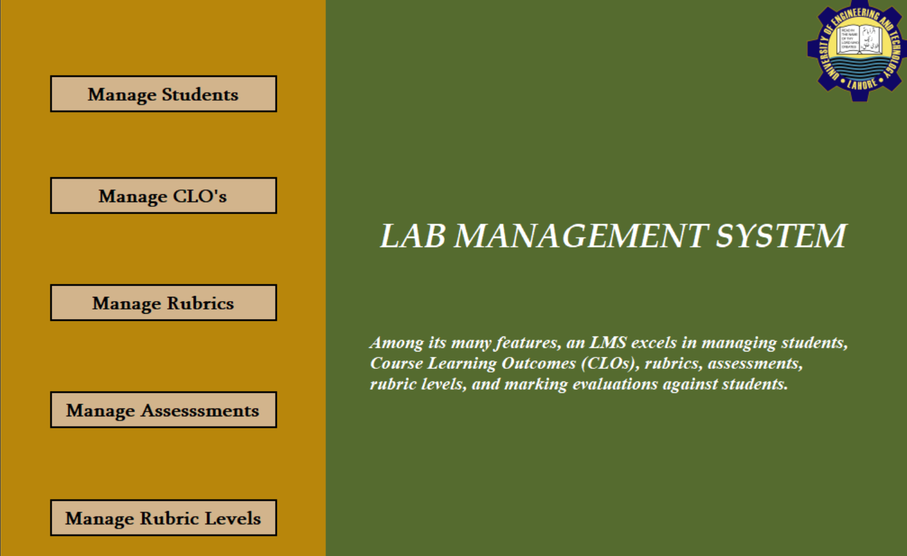

# LMS

**LMS** is a Windows Forms Application developed in C# with SQL database integration. It streamlines the management of student evaluations for a course lab, allowing teachers to efficiently handle various academic components related to Outcome-Based Education (OBE).

## Table of Contents
- [Features](#features)
- [Screenshots](#screenshots)
- [Usage](#usage)
- [Documentation](#documentation)
- [Technologies Used](#technologies-used)
- [Contributing](#contributing)
- [License](#license)

## Features
- **Manage Students**: Add, edit, and delete student records.
- **Manage Course Learning Outcomes (CLOs)**: Organize and maintain CLOs associated with courses.
- **Manage Rubrics**: Create and modify rubrics to define assessment criteria.
- **Manage Assessments**: Create and manage assessments linked to CLOs and rubrics.
- **Manage Rubric Levels**: Define performance levels within the rubric for nuanced evaluations.
- **Mark Evaluations**: Record evaluations for students based on their assessment performance.
- **Reporting**: Generate crystal PDF reports, including CLO-wise and assessment-wise class results.

## Screenshots

## Usage
1. Clone the repository:
   `git clone https://github.com/miansaadtahir/LabManagementSystem.git`
2. Navigate to:
   `cd LabManagementSystem/script`
3. Run the `ProjectBScripts.sql` in SSMS
4. Navigate to the project directory:
   `cd LabManagementSystem/ProjectB/bin/Debug`
5. Launch the `ProjectB.exe` file.

## Documentation
For a detailed overview of the project and its features, visit the [Documentation](./documentation/) in the repository.

## Technologies Used
- C#
- Windows Forms
- MSSQL Database

## Contributing
Contributions, issues, and feature requests are welcome!  
Feel free to check out the [issues page](https://github.com/miansaadtahir/LabManagementSystem/issues) for more information.

## License
Distributed under the MIT License. See [LICENSE](./LICENSE) for more details.
